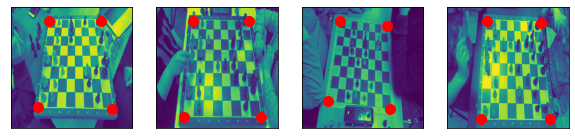
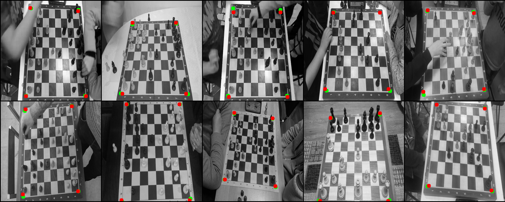

# Chess keypoint detection



This repository contains source code of chess keypoint detection task, that was given as a test task in FreeFlex
company. In this repo I demonstrate how to solve problem of keypoint detection using pytorch and torchvision frameworks.

---

## Links to data/weights/reports

- Dataset
  files: [google disk](https://wandb.ai/homomorfism/TmpChessKeypointDetection/reports/Keypoint-detection-Freeflex---VmlldzoxMDc3Mjc1?accessToken=ld7wwg9btyqcglb04c253811pj6o1ahj2b6eqosryz9z33hkbx13739d1901cj7j)
- Pretrained on this dataset
  weights: [google disk](https://drive.google.com/drive/folders/1nnQPQj8YdhH-lbJNuOHUQC4qaSyDJ1Dn?usp=sharing)
- Kaggle training script: [kaggle link](https://www.kaggle.com/hashshes/keypoint-detection)
- Training reports (w/ graphs of losses and
  images): [wandb.ai](https://wandb.ai/homomorfism/TmpChessKeypointDetection/reports/Keypoint-detection-Freeflex---VmlldzoxMDc3Mjc1?accessToken=ld7wwg9btyqcglb04c253811pj6o1ahj2b6eqosryz9z33hkbx13739d1901cj7j)

---

## Table of content

1. Dataset description
2. Launching training
3. The structure of repository file
4. Training process
5. Visualization of predictions results
6. Stack of technologies
7. Limitations of project
8. Contributions

---

## Description of training data

Dataset consists from different files:

- `xtrain.npy` - numpy array file of shape (15137, 256, 256, 1) - 15137 gray square images of size (256, 256), pixel
  range: 0.-255.
- `ytrain.npy` - numpy array file of shape (15137, 8) - 15137 keypoints (x1, y2, x2, y2 ...), range of values: 0.-1. (
  should be denormalized for passing to model)
- `xtrain.npy` - numpy array file of shape (5, 256, 256, 1) - 5 test images.


*Visualization of training data (red points are keypoints of chess desk)*

---

## Launch training

Steps for setting up training/testing process (assuming training locally).

0. (Optionally) Register on [wandb.ai](https://wandb.ai) for saving logs and weights of model.
1. Download dataset
   from [google disk](https://wandb.ai/homomorfism/TmpChessKeypointDetection/reports/Keypoint-detection-Freeflex---VmlldzoxMDc3Mjc1?accessToken=ld7wwg9btyqcglb04c253811pj6o1ahj2b6eqosryz9z33hkbx13739d1901cj7j)
   and put it into ```data/``` folder (so, data folder should contain 3 files - `xtest.npy`, `xtrain.npy`
   and `ytrain.npy`)
2. Install requirements file for project: `python -m pip install -r requirements.txt` (if something went wrong -
   try `pip install -r requirements-dev.txt`)
3. (Optionally) Change default batch size, parameters of model in `config/config.yaml` file
4. Run training: `python train.py`
    1. In training script you will be asked for api key for connecting to [wandb.ai](https://wandb.ai) - follow
       instructions.

---

## The structure of repository file

- ```config/config.yaml``` - config, used for training model (lr, batch-size, etc, hyperparameters of model should be
  set here or from command line)
- ```data/``` - data folder, used for storing data (should contain ```xtest.npy  xtrain.npy  ytrain.npy``` files for
  training/testing)
- ```models/```
    - ```dataloader.py``` - making the dataloader from the dataset: torchvision uses special format of inputs, so there
      was a need of writing custom collate function
    - ```dataset.py``` - reading dataset from numpy files, wrapping it into default pytorch dataset class
    - ```trainer.py``` - defining training/testing loop
- ```jupyter-notebooks/``` - visualizing and training/testing notebooks
- ```train.py``` - training script, setting image logging and running trainer class from pytorch-lightning library

---

## Training process

Training time - 3h 40m

Model was trained on 4 epochs (the curve of errors goes to plateau, no need to train the model more):
2 epochs with learning rate 0.001, 2 epochs with learning rate 0.0001, batch size - 10 (batch size 16 did not in kaggle
VRAM).

Confidence threshold for scores of prediction take 0.7 - detection the boarders of chess was a simple task, no need to
spend much time of tuning parameters.

 *Charts of training errors,
check [wandb.ai](https://wandb.ai/homomorfism/TmpChessKeypointDetection/reports/Keypoint-detection-Freeflex---VmlldzoxMDc3Mjc1?accessToken=ld7wwg9btyqcglb04c253811pj6o1ahj2b6eqosryz9z33hkbx13739d1901cj7j)
report for more details*

---

## Visualization of predictions results

Red points - prediction of model, green points - labels of dataset.

 *Validation dataset - we could see that quite well detects
boarders*

 *Test images - we could see that model mistakes when keypoint is hidden by hand*

---

## Used stack of technologies

- `pytorch/pytorch-lightning` for data extraction and training loop
- `torchvision` for keypoint detection model
- `hydra` for configuration model/data
- `wandb` for logging images/losses (optional)
- `opencv` for plotting points

---

## Limitations of project

Torchvision requires explicitly setting if keypoint is hidden or not - so that's why points, predicted on test images,
are not well predicted if they are hidden by hand.

---

## Contributions

Contributions are welcome, please open PR and describe the implemented functionality.


