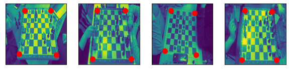
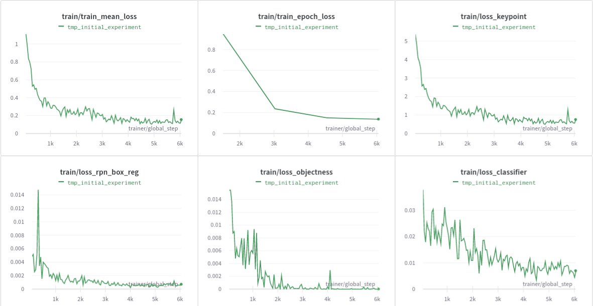
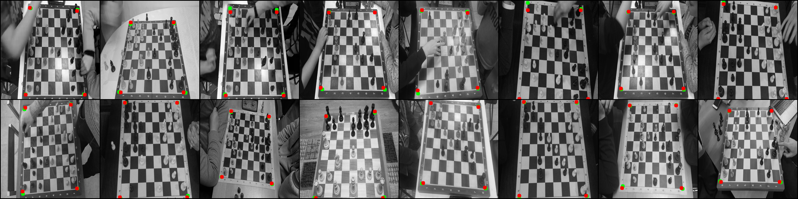
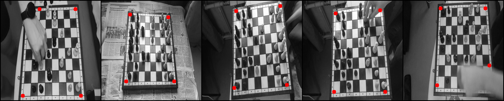

# Chess keypoint detection

This repository contains source code of chess keypoint detection task.

## Links:

- dataset
  - [google disk](https://wandb.ai/homomorfism/TmpChessKeypointDetection/reports/Keypoint-detection-Freeflex---VmlldzoxMDc3Mjc1?accessToken=ld7wwg9btyqcglb04c253811pj6o1ahj2b6eqosryz9z33hkbx13739d1901cj7j)
- pretrained weights
  - [google disk](https://drive.google.com/drive/folders/1nnQPQj8YdhH-lbJNuOHUQC4qaSyDJ1Dn?usp=sharing)
- kaggle training script - [kaggle link](https://www.kaggle.com/hashshes/keypoint-detection)
- training report (w/ graphs, images) - [wandb.ai](https://wandb.ai/homomorfism/TmpChessKeypointDetection/reports/Keypoint-detection-Freeflex---VmlldzoxMDc3Mjc1?accessToken=ld7wwg9btyqcglb04c253811pj6o1ahj2b6eqosryz9z33hkbx13739d1901cj7j)

## Used technologies

- pytorch/pytorch-lightning for data extraction and training loop
- torchvision for keypoint detection model
- hydra for configuration model/data
- wandb for logging images/losses (optional)
- opencv for plotting points

## Visualisation of train data



## Launch training

Download data
from [google disk](https://wandb.ai/homomorfism/TmpChessKeypointDetection/reports/Keypoint-detection-Freeflex---VmlldzoxMDc3Mjc1?accessToken=ld7wwg9btyqcglb04c253811pj6o1ahj2b6eqosryz9z33hkbx13739d1901cj7j)
and put it into ```data/``` folder.

Run in console:

```bash
python -m pip install -r requirements.txt
python train.py
```

## The structure of repository

- ```config/config.yaml``` - config, used for training model (lr, batch-size, etc.)
- ```data/``` - data folder, used for storing data (should contain ```xtest.npy  xtrain.npy  ytrain.npy``` files for
  training)
- ```models/```
  - ```dataloader.py and dataset.py``` - creating dataset and dataloader (overloading
    torch.utils.data.Dataset/Dataloader)
  - ```trainer.py``` - lighting training/testing loop
- ```jupyter-notebooks/``` - visualizing and training/testing notebooks

- ```train.py``` - training script fot

## Training curves (more on wandb.ai)



## Results of training

Samples from last epoch:

- on validation dataset (red points are predictions, green point are true labels)
  
- on test dataset (red points are predictions)
  

## Contributions

Contributions are welcome, please open PR and describe the implemented functionality.


